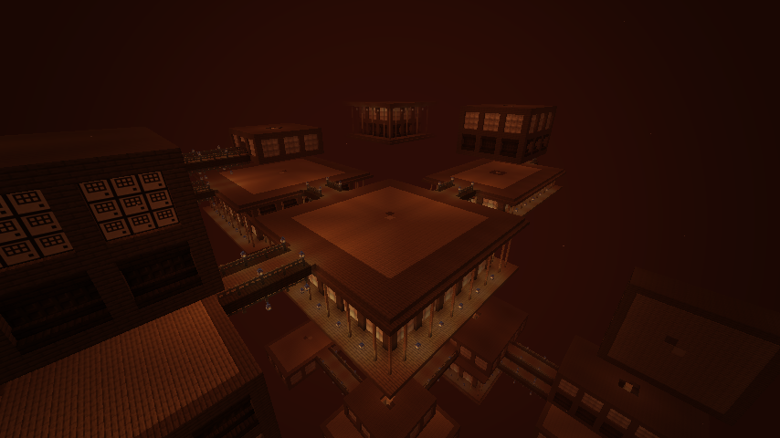
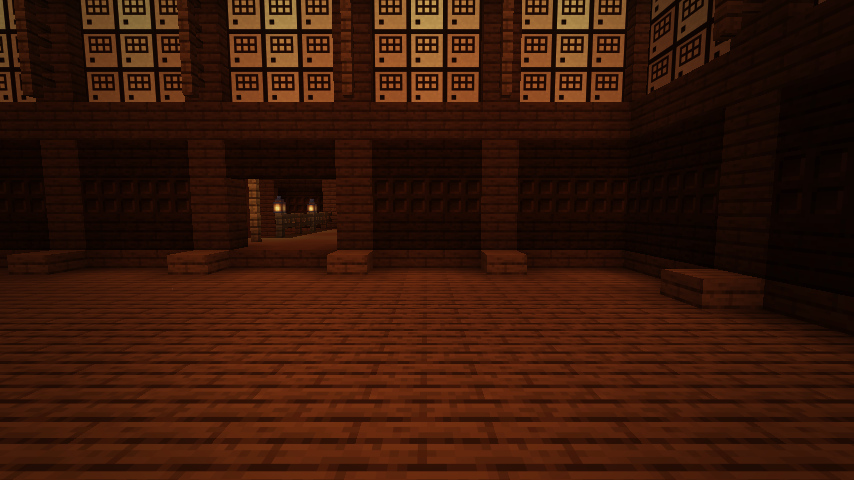
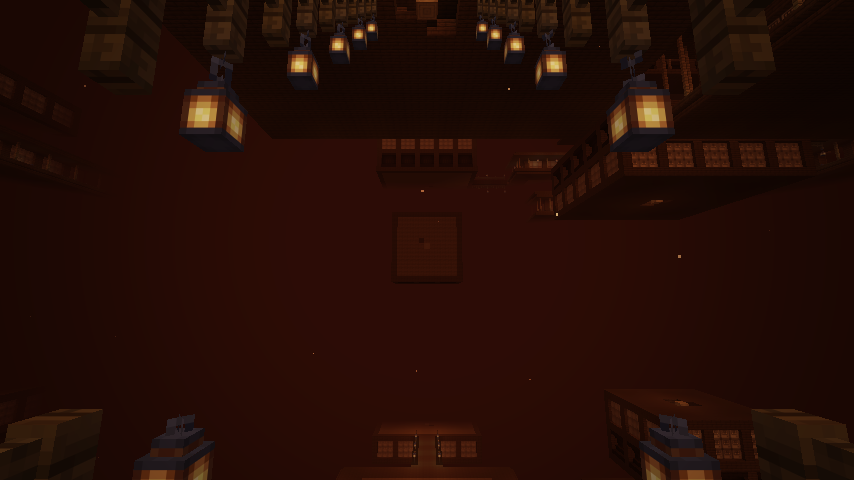
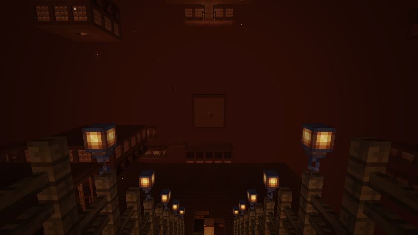

# Infinity Castle

An endless castle of fusuma-walled rooms, lantern-lit bridges and upside-down halls, for Minecraft 26.3 on Fabric.
Gravity and the camera flip as you move between floors.

Inspired by the **Infinity Castle (無限城, *Mugen-jō*)** from *Demon Slayer: Kimetsu no Yaiba*. This is an unofficial
fan project and isn't affiliated with or endorsed by the creators or rights holders.



## Features

- **Hand-built rooms, laid out procedurally.** The twelve buildings and the bridges were designed block by block in
  Minecraft (see [The designs](#the-designs)). Every world seed arranges them differently: lone pavilions, dead-end
  rooms, long corridors, halls at junctions and stairwells are placed on a grid and joined by bridges that always line
  up with the sliding doors. Gaps between them open onto the void.
- **Floors with two faces.** Each floor has upright rooms on its lower deck and a second set of rooms hanging upside
  down from the deck above. Sixteen floors are stacked, and they wrap: fall off the bottom and you tumble back in at the
  top.
- **Gravity that flips.** Halfway between the two decks of each floor is an *equator*. Cross it and gravity reverses,
  so you fall "up" onto the ceiling and walk around the hanging rooms. Every floor has **stairwells**: tall halls whose
  spiral stair climbs to a hatch in the roof, where a long staircase carries on up to a landing just below the equator.
  Jump from the landing and you flip onto its mirror image above.
- **A camera that follows.** When gravity flips, the view rolls over smoothly, and mouse and strafe controls mirror so
  they still match what you see. Some floors hold the camera at a slight uneasy tilt, and on "drifting" floors gravity
  is lighter.
- **No sky, no horizon.** The dimension has no skybox, sun, stars or clouds. Everything fades into ember-red fog, so
  the castle seems to go on forever in every direction.
- **The castle's red–amber glow.** Warm lantern light and back-lit fusuma panels, plus a colour-grading post effect
  that split-tones shadows toward crimson and highlights toward amber, and darkens the corners of the screen.
- **Japanese architecture.** Fusuma sliding doors with lattice windows, dark-oak lattice bands, sunken room floors,
  lantern-lit verandas under spruce eaves, and spiral stairs around a birch newel post in every room. Floors are named
  in Japanese as you enter them (第九層, "ninth floor").

| Entrance hall | Stairwell landing | After the flip |
| --- | --- | --- |
|  |  |  |

## The designs

The buildings and bridges were designed in-game by the author's son in a flat creative world, then imported into the
mod. There are three footprints (a 13-block square, a larger square and a long room) in four styles:

| Style | Walls | Height |
| --- | --- | --- |
| Plain | Fusuma panels between spruce posts | Single storey |
| Banded | A dark-oak stair-and-trapdoor lattice band below the fusuma | Tall |
| Veranda | Plain walls wrapped in a lantern-lit veranda under spruce eaves | Single storey |
| Veranda, banded | Banded walls inside the veranda | Tall |

Every room has an oak-slab floor sunk half a block into its spruce frame, hanging lanterns, and a spiral stair around
a stripped birch post that climbs through a hatch onto the flat roof. The bridges are a spruce walkway between dark-oak
kerbs, with alternating fences and gates for rails and a lantern on every fourth post. The rails and lanterns are
repeated upside down under the walkway, so the bridges look right from both sides of a flipped floor. The long
staircases to the gravity gates climb at forty-five degrees with the same rails.

The designs live in `src/main/resources/data/infinitycastle/designs` as readable text, one layer per block of height,
and are imported from the design world with `tools/DesignImport.java` (see [Building from source](#building-from-source)).
The one modded block the designs used, the fusuma panel from the *Kimetsu no Yaiba* Forge mod, is recreated here as the
mod's own **fusuma** block, since that mod is Forge-only and for older game versions.

## Getting in

Craft a **biwa** and use it to be drawn into the castle; use it again inside to be released back to where you came
from.

```
  S      S = string
 ES      E = ender pearl
PP       P = dark oak planks
```

Operators can use commands instead:

| Command | What it does |
| --- | --- |
| `/infinitycastle enter [players]` | Draws players into the castle's entrance hall |
| `/infinitycastle leave [players]` | Returns players to where they entered from |
| `/infinitycastle where` | Names your floor, half, gravity direction and the room you're in (anyone can use this) |
| `/infinitycastle stairwell` | Takes you to the nearest gravity gate on your floor |

The building blocks (fusuma, tatami, shoji wall, shoji screen, lacquered planks, paper lantern) are craftable and appear
in their own creative tab.

## Installation

1. Install [Fabric Loader](https://fabricmc.net/use/) 0.19.5 or newer for Minecraft 26.3.
2. Put [Fabric API](https://modrinth.com/mod/fabric-api) and the Infinity Castle jar in your `mods` folder.
3. The mod is needed on both the client and the server.

## Client settings

The camera effects can be disorienting, so each one can be turned off in `config/infinitycastle-client.json`:

| Setting | Default | Effect |
| --- | --- | --- |
| `smoothFlip` | `true` | Animate the camera roll when gravity flips instead of snapping |
| `rollCameraWhenInverted` | `true` | Turn the view upside down while standing on a ceiling |
| `mirrorControlsWhenInverted` | `true` | Mirror mouse and strafe input while the view is upside down |
| `floorTilt` | `true` | Allow the constant tilt on some floors |
| `colorGrade` | `true` | The red–amber colour grade and vignette |

## How it works

The generator is pure Java with no Minecraft dependencies, so it can be unit-tested directly:

```
gen/        CastleLayout     decides each cell's module from the seed and shared-edge hashes
            Designs, Template the hand-built designs, loaded from text and turned to face the bridges
            Modules          stamps a design into a 32×24×32 Canvas and draws its bridges or staircase
            CellPlacer       places canvases into the world, flipping upper-half cells upside down
gravity/    GravityRules     equator-crossing rules and vertical wrapping
            FloorProfile     per-floor gravity scale, camera tilt and Japanese floor names
            RollAnimator     easing for the camera roll
world/      CastleChunkGenerator, CastlePalette (materials → block states), CastleTeleporter
mixin/      collision, stepping, fall damage, jumping and eye height for inverted gravity
client/     camera roll, mirrored controls, upside-down player rendering, colour grade
```

Each cell of the castle is two chunks wide. A chunk builds the whole cell it belongs to and keeps its own quarter, so
chunks can still be generated independently and in any order. The building in a cell is centred, which puts the door in
the middle of each side on the cell's centre line, and the bridges between cells are phased on world coordinates so the
fence-and-gate pattern runs unbroken from one cell into the next.

Gravity uses the vanilla `minecraft:gravity` attribute. A negative value makes an entity fall upward, and vanilla
already handles the movement, syncing and anti-flight checks for that. The mixins then mirror the rest of the physics:
landing on a ceiling counts as being on the ground, jumping pushes away from it, stepping onto a slab works in reverse,
and falling upward still does fall damage. Eye height is mirrored too, so the camera and every raycast sit where your
head actually is.

Gravity flips only when your centre crosses an equator. It does *not* flip when you fall through the gap between two
floors: that boundary has upright rooms on one side and inverted rooms on the other, and flipping there would trap you
bouncing between them.

## Building from source

You need JDK 25.

```sh
./gradlew build              # compile, unit tests and server game tests → build/libs/
./gradlew runClient          # play in a development client
./gradlew runClientGameTest  # end-to-end client test; screenshots land in build/run/clientGameTest/screenshots
java tools/TextureGen.java   # regenerate the textures from code
java tools/DesignImport.java "Infinity castle _ Designs.zip"   # re-import the designs from the design world
```

The design world is a Forge 1.20.1 world save that is kept outside the repository. `DesignImport` reads its region
files directly (from the zip or an extracted folder), so it needs no Minecraft installation. Each building is saved in
the world twice, marked with structure blocks: once with every wall closed and once, thirty blocks higher, with the door
in the middle of each side slid open. The importer records the difference as a per-side door patch, which is how the
generator opens only the doors a cell needs. See `CONTRIBUTING.md` for how to add a design.

### Tests

- **Unit tests** (`src/test`) cover the layout, designs, modules and gravity rules. For example, they check that
  neighbouring cells agree on every shared edge, that every design has a complete floor, a roof hatch and a door on each
  side, that you can walk from every open edge over the bridge and through the door into the room, and that every
  lantern is still supported after the upside-down flip. The stairwell is walked with a climbing search from the room
  floor, up the spiral stair, across the roof and up the long staircase to the landing. There is also a tick-by-tick
  simulation with vanilla's jump and gravity constants showing a jump from the landing carries you through the gravity
  gate and back, and the mirrored step logic is tested against real Minecraft collision shapes.
- **Server game tests** (`src/gametest`) run inside a real server. They check that generated chunks match the pure
  layout block for block, the entrance is safe, entering and leaving round-trips a player, gravity flips at the equator
  with mirrored eye height, and an inverted player lands on a ceiling and jumps away from it.
- **Client game test** runs a real client. It enters the castle, stands on a stairwell landing, presses jump, and
  asserts the player ends up inverted on the landing above with the camera rolled over, then jumps back.

## Known limitations

- Gravity only flips up and down. The sideways rooms are scenery; true wall-walking would need a full gravity-changer
  rewrite of player physics.
- Only players are affected by the castle's gravity. Dropped items and mobs fall normally, so items dropped in the
  upper half fall away into the void.
- Sneaking doesn't stop you walking off a ceiling edge.
- Fusuma panels don't slide: a doorway is a panel the generator left out.
- The castle has no inhabitants yet.

See [CONTRIBUTING.md](CONTRIBUTING.md) if you'd like to help with any of these.

## License

[MIT](LICENSE). *Demon Slayer*, *Kimetsu no Yaiba* and related names belong to their respective owners.
